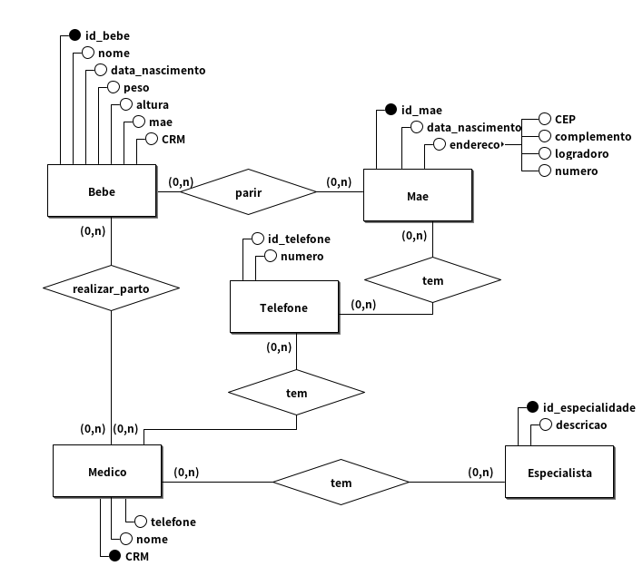
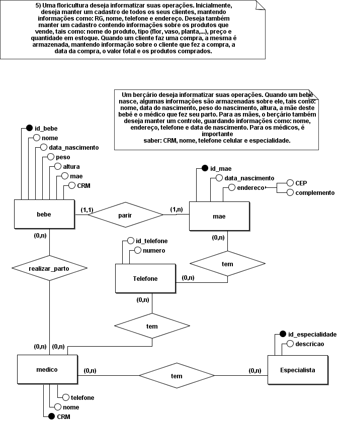
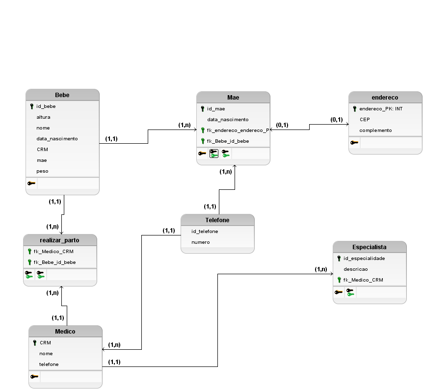

# Modelagem conceitual 1.0

## Regra de negocio/Requisito

Um berçário deseja informatizar suas operações. Quando um bebê
nasce, algumas informações são armazenadas sobre ele, tais como:
nome, data do nascimento, peso do nascimento, altura, a mãe deste
bebê e o médico que fez seu parto. Para as mães, o berçário também
deseja manter um controle, guardando informações como: nome,
endereço, telefone e data de nascimento. Para os médicos, é importante
saber: CRM, nome, telefone celular e especialidade.

## Modelo conceitual (DER 1.0)

## Cardinalidade

## Modelo Logico (DER 2.0)

[VOLTAR](../README.md)
