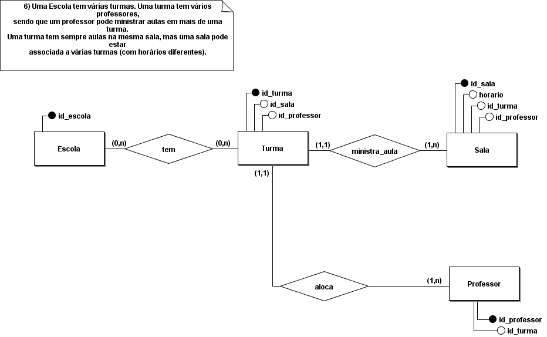

# Modelagem conceitual 1.0

## Regra de negocio/Requisito

Uma Escola tem várias turmas. Uma turma tem vários professores,
sendo que um professor pode ministrar aulas em mais de uma turma.
Uma turma tem sempre aulas na mesma sala, mas uma sala pode estar
associada a várias turmas (com horários diferentes).

## Modelo conceitual (DER 1.0)

## Cardinalidade

![]

## Modelo Logico (DER 2.0)

[VOLTAR](../README.md)
