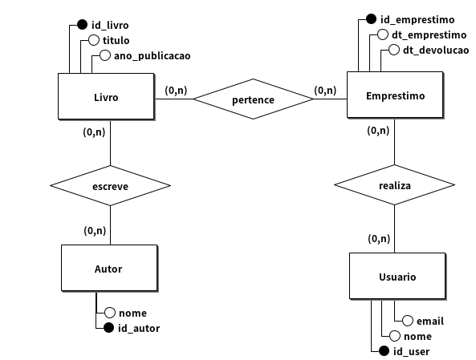
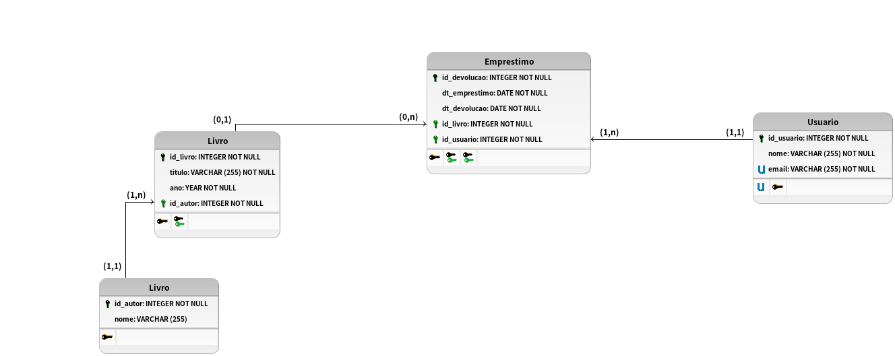

# Modelagem conceitual 1.0

## Regra de negocio/Requisito

Um sistema de biblioteca precisa ser desenvolvido para gerenciar os empréstimos de livros. Os usuários podem pegar livros emprestados, e é necessário controlar a data de empréstimo e a data de devolução. Cada livro possui um título, um autor e um ano de publicação, e cada usuário precisa ser registrado com nome e e-mail. Modele o sistema de modo que a biblioteca possa controlar seus empréstimos e gerenciar seus livros e usuários.

## Modelo conceitual (DER 1.0)

## Cardinalidade

## Modelo Logico (DER 2.0)

[VOLTAR](../README.md)
