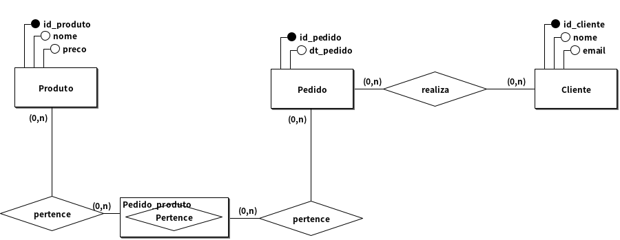
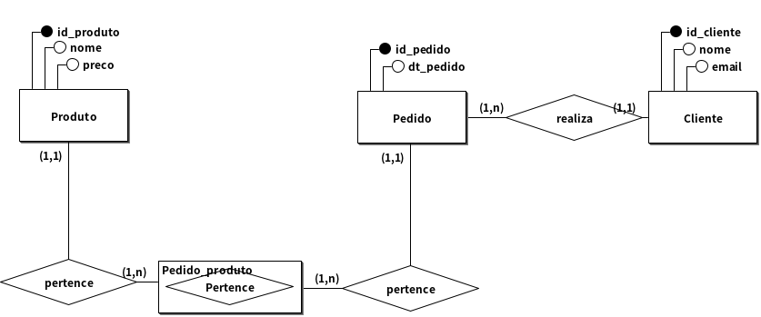
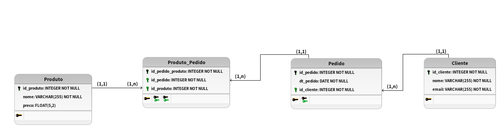

# Modelagem conceitual 1.0

## Regra de negocio/Requisito

Você é responsável por criar um sistema de vendas para uma loja online. O sistema deve registrar os pedidos feitos pelos clientes, sendo que cada pedido contém produtos, e é necessário armazenar o nome do produto e seu preço. Além disso, é preciso registrar informações dos clientes, como nome e e-mail, e dos pedidos, como a data em que foram realizados. Desenvolva o modelo conceitual para este sistema, incluindo as entidades e relacionamentos necessários.

## Modelo conceitual (DER 1.0)

## Cardinalidade

## Modelo Logico (DER 2.0)

[VOLTAR](../README.md)
