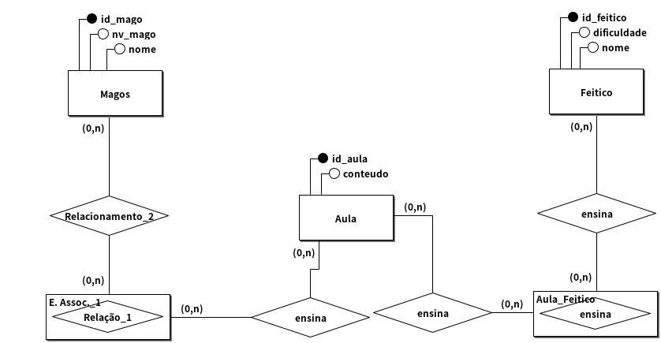

# Modelagem conceitual 1.0

## Regra de negocio/Requisito

Como desenvolvedor de sistemas para uma escola de magia, você precisa criar um modelo de banco de dados. A escola quer registrar informações sobre seus magos, que participam de aulas para aprender feitiços. As aulas são ministradas por professores e os feitiços variam em nível de dificuldade. Cada mago tem um nome e um nível de magia. Modele esse sistema e defina como as aulas, os feitiços e os magos se relacionam.

## Modelo conceitual (DER 1.0)

## Cardinalidade

## Modelo Logico (DER 2.0)

[VOLTAR](../README.md)
