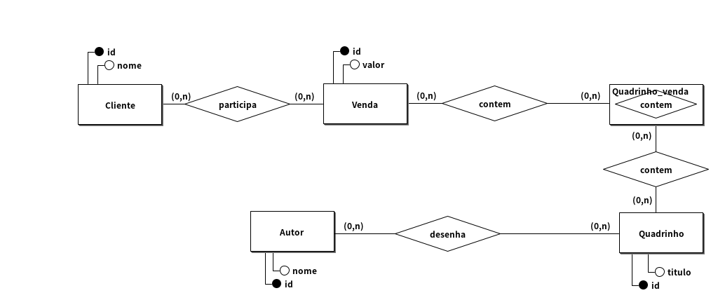
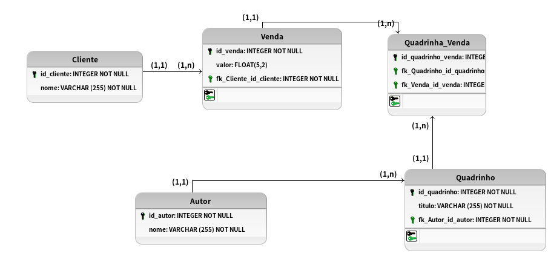

# Modelagem conceitual 1.0

## Regra de negocio/Requisito

Você foi contratado por uma loja de quadrinhos que precisa organizar suas informações. A loja quer gerenciar clientes, quadrinhos e vendas. Cada venda deve registrar os quadrinhos comprados, e cada cliente precisa ser identificado. Alguns dados como o título e o autor dos quadrinhos são essenciais. Modele o sistema de vendas da loja, organizando as relações entre clientes, quadrinhos e as transações de venda.

## Modelo conceitual (DER 1.0)

## Cardinalidade

## Modelo Logico (DER 2.0)

[VOLTAR](../README.md)
