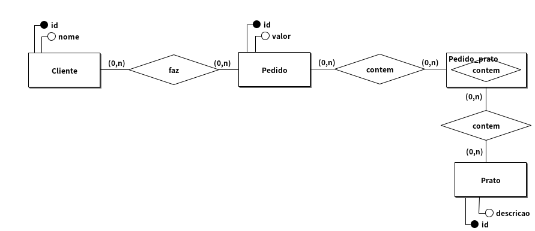
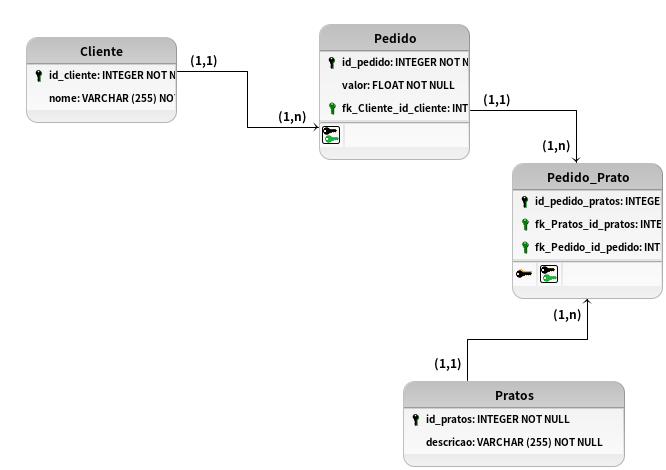

# Modelagem conceitual 1.0

## Regra de negocio/Requisito

Um restaurante intergaláctico precisa de um banco de dados para gerenciar seus pedidos. Os clientes vêm de diferentes planetas e fazem pedidos que contêm pratos especiais de várias galáxias. Cada prato tem um ingrediente principal que o torna único. O sistema precisa armazenar os pedidos realizados pelos clientes e o valor total de cada pedido. Modele esse sistema, considerando as interações entre clientes, pratos e pedidos.

## Modelo conceitual (DER 1.0)

## Cardinalidade

## Modelo Logico (DER 2.0)

[VOLTAR](../README.md)
