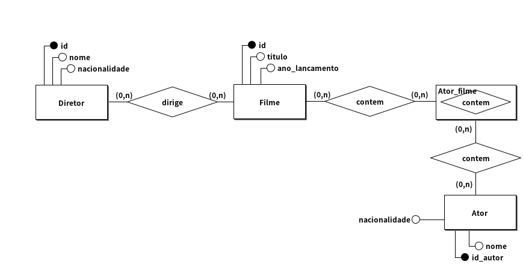
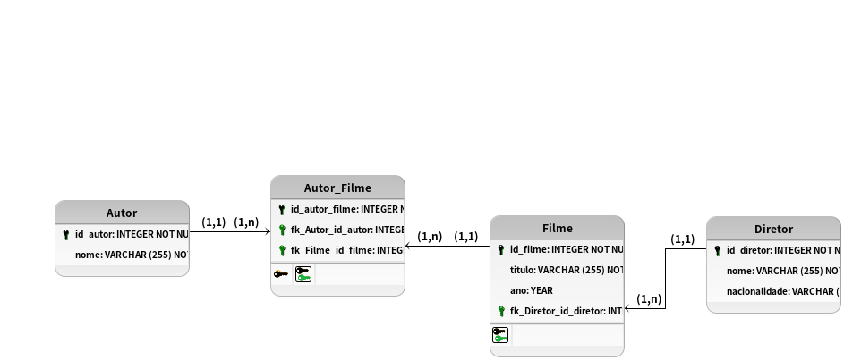

# Modelagem conceitual 1.0

## Regra de negocio/Requisito

Um estúdio de cinema contratou você para desenvolver o sistema que gerencia seus filmes. Cada filme tem um diretor e pode ter vários atores, e o estúdio quer registrar informações como o título do filme e o ano de lançamento. Cada diretor possui uma nacionalidade e já pode ter dirigido vários filmes. Modele o sistema de forma que as relações entre filmes, diretores e atores sejam bem representadas.

## Modelo conceitual (DER 1.0)

## Cardinalidade

## Modelo Logico (DER 2.0)

[VOLTAR](../README.md)
